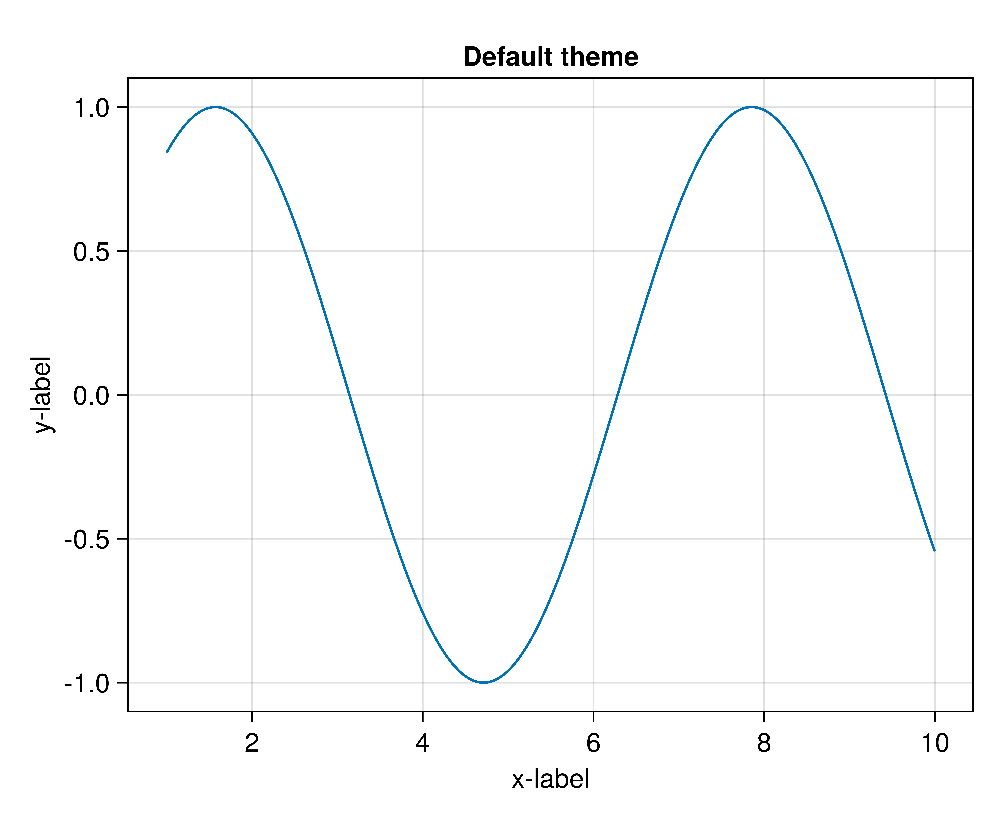
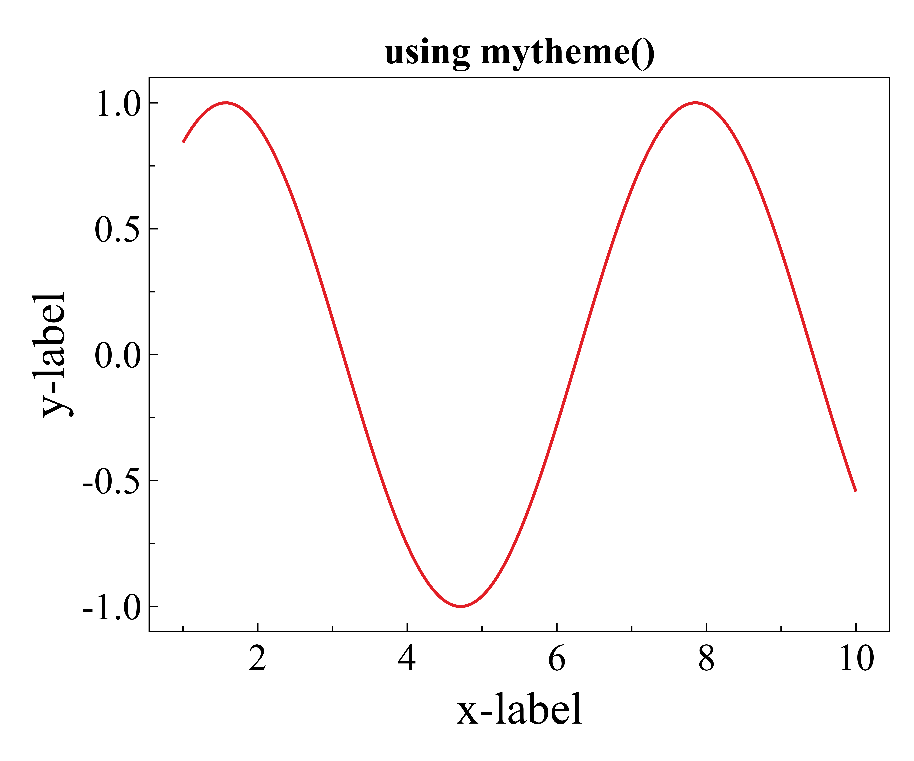

# MyMakieTools.jl

A self-used Julia package consists of tools for making scientific figures using [Makie.jl](https://github.com/MakieOrg/Makie.jl).

## Installation
```julia
julia> ]
(@v1.8) pkg> add https://github.com/himcraft/MyMakieTools.jl
```

## Usage
### `mytheme()`
##### Plotting with custom theme
```julia
set_theme!(mytheme())
```
##### e.g.



### `logaxis()`
#### Plotting figures with `log10` scales
```julia
f=Figure()
ax=logaxis(f;title="using logaxis()",xlabel="x-label",ylabel="y-label")
```
#### e.g.


### `savefig()`
#### Save figure as `.png` and/or `.pdf`
```julia
f,ax,l=lines(1..10,sin)
savefig("figure_name",f,pdf=true,png=true,prefix="./figures/")
```


