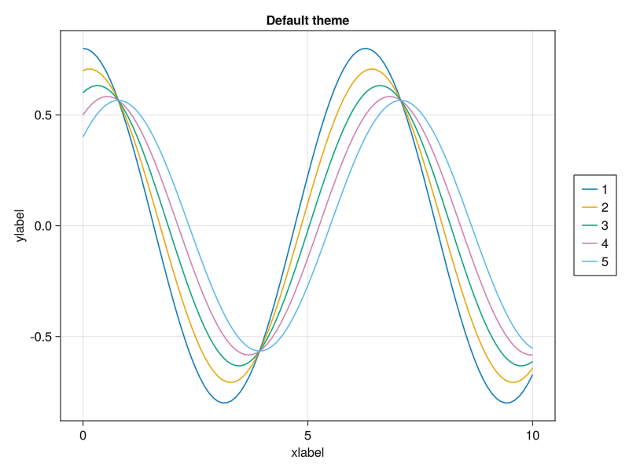
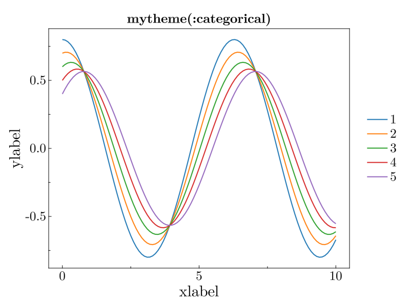
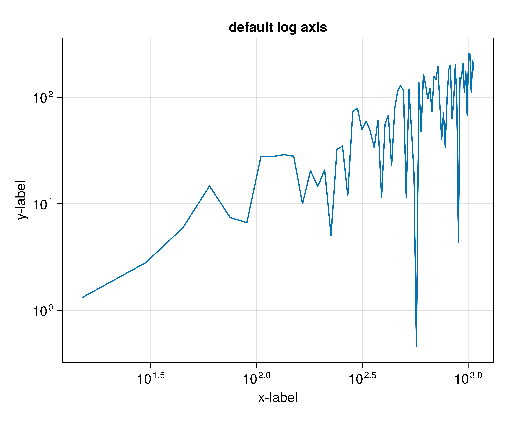
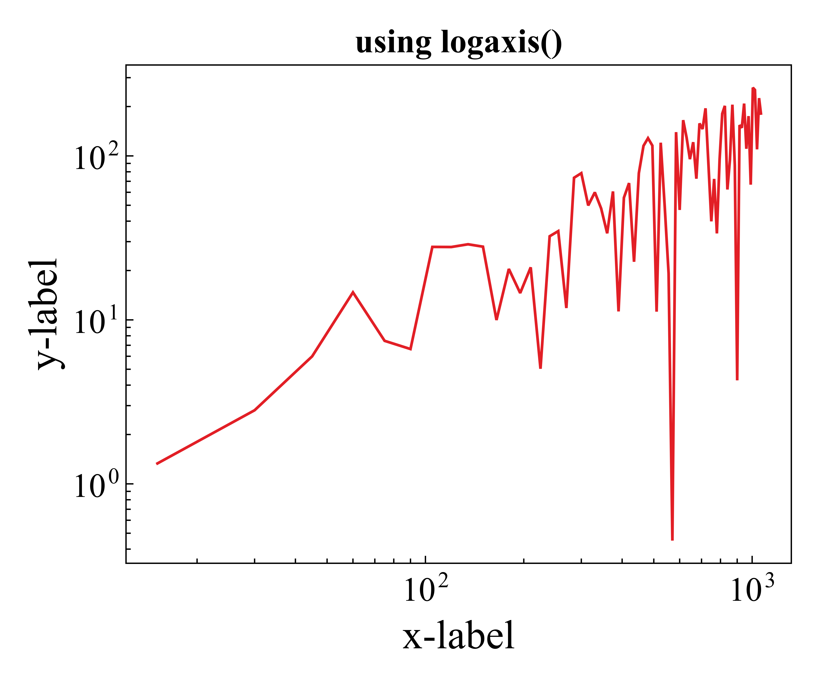

# MyMakieTools.jl

A self-used Julia package consists of tools for making scientific figures using [Makie.jl](https://github.com/MakieOrg/Makie.jl).

## Installation
```julia
julia> ]
(@v1.8) pkg> add https://github.com/himcraft/MyMakieTools.jl
```

## Usage
### `mytheme()`
#### Plotting with custom theme
```julia
set_theme!(mytheme())
```
##### e.g.



#### Choosing different palette
```julia
set_theme!(mytheme(:doublet))
set_theme!(mytheme(:lajolla))
```

### `logaxis()`
#### Plotting figures with `log10` scales
```julia
f=Figure()
ax=logaxis(f;title="using logaxis()",xlabel="x-label",ylabel="y-label")
```
##### e.g.



### `savefig()`
#### Save figure as `.png` and/or `.pdf`
```julia
f,ax,l=lines(1..10,sin)
savefig("figure_name",f,pdf=true,png=true,prefix="./figures/")
```

### `get_palette_colors()`
#### Access the current palette in a vector.
```julia
set_theme!(mytheme(:diverging))
get_palette_colors()
```
Return:
```julia
10-element Vector{ColorTypes.RGB{Float64}}:
 RGB(0.4923, 0.0908, 0.0001)
 RGB(0.5977, 0.3203, 0.082)
 RGB(0.6875, 0.5, 0.168)
 RGB(0.7812, 0.7031, 0.332)
 RGB(0.8125, 0.8867, 0.6367)
 RGB(0.6406, 0.8945, 0.8242)
 RGB(0.3633, 0.7539, 0.8242)
 RGB(0.1953, 0.5703, 0.7578)
 RGB(0.125, 0.3906, 0.6797)
 RGB(0.0117, 0.1914, 0.5938)
```
